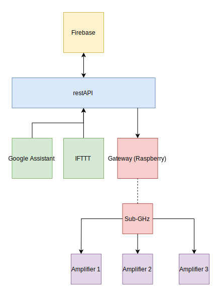
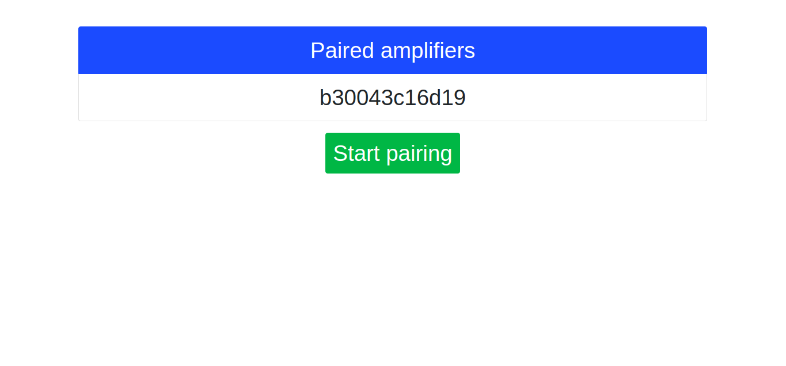

Smart Amplifier has 2 layers: cloud and electronics. Basically you have amplifier with Sub-Ghz Radio communicating with Raspberry Pi so you can place Raspberry somewhere close to internet connection and amplifier can be at speakers. Only thing you have to do is plug Raspberry to electricity and internet. You can easily pair new amplifier via web user interface described in [Gateway section](https://smartamplifier.github.io/#gateway). All benefit is that you can easily control amplifier via restAPI hosted at our server so you can easily integrate 3rd party apps like [IFTTT](https://ifttt.com/).



## Electronoics

TODO

## Gateway

After you connect gateway to internet, you can open web user interface in browser by typing IP address of Gateway or DNS name [http://smart-amplifier-gateway.local](http://smart-amplifier-gateway.local). In user interface you can list connected amplifiers and pair new one. Via this ID you can control volume or pair it with Google account and use Google Assistant action.



## Cloud

One of the most important parts in Smart Amplifier project is Cloud. As was told previously, you can control amplifier via restAPI. Full documentation is in [backend](https://github.com/SmartAmplifier/backend/blob/master/README.md) repository, but here is little sneaky peaky:

request (POST):

    http://smart-amplifier-api.radimkozak.com/change/volume/by/id

body:

```
{
    "amplifier": <amplifier-id>,
    "volume": <volume>
}
```

where `<amplifier-id>` is id you can find in web user interface of gateway and `<volume>` is in `%` so it can be from 0 to 100.
